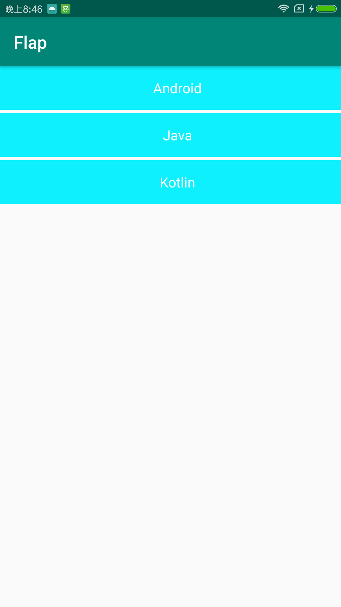

# Flap

[ ](https://bintray.com/alancheen/maven/flap/0.5.0/link) [](https://travis-ci.org/AlanCheen/Flap)


Flap is an library that makes `RecyclerView.Adapter` more easier to use , especially when you have to support lots of different type ViewHolders.

Flap can save your day by keeping you from writing boilerplate codes.

Have a try , thanks !

## Integrate Flap

Add the latest Flap to your dependencies:

```groovy
dependencies {
    implementation 'me.yifeiyuan.flap:flap:$lastest_version'
}
```

## Usage


#### Step 1 : Create a model class :

A model class can be a POJO or Java Bean.

```java
public class SimpleTextModel {

    @NonNull
    public String content;

    public SimpleTextModel(@NonNull final String content) {
        this.content = content;
    }
}
```

#### Step 2 : Create a `FlapItem` and a `FlapItemFactory` :

`FlapItem` is the base `ViewHolder` that Flap is using which provides some useful methods.

`FlapItemFactory` tells Flap how to create a  `FlapItem` as you wish.

Here is a sample :

```java
public class SimpleTextItem extends FlapItem<SimpleTextModel> {

    private TextView tvContent;

    public SimpleTextItem(final View itemView) {
        super(itemView);
        tvContent = findViewById(R.id.tv_content);
    }

    @Override
    protected void onBind(final SimpleTextModel model) {
        tvContent.setText(model.content);
    }

    public static class SimpleTextItemFactory implements FlapItemFactory<SimpleTextModel> {

        @NonNull
        @Override
        public FlapItem onCreateViewHolder(@NonNull final LayoutInflater inflater, @NonNull final ViewGroup parent, final int viewType) {
            return new SimpleTextItem(inflater.inflate(viewType, parent, false));
        }

        @Override
        public int getItemViewType(final SimpleTextModel model) {
            return R.layout.flap_item_simple_text;
        }
    }
}
```

If you don't like writing `new SimpleTextItem(inflater.inflate(viewType, parent, false))` in every `ItemFactory` ,
you can try `LayoutItemFactory` , which is more simple , but it contains reflection code you may hate. 


```java
public static class SimpleTextItemFactory extends LayoutItemFactory<SimpleTextModel,SimpleTextItem> {
    @Override
    protected int getLayoutResId(final SimpleTextModel model) {
        return R.layout.flap_item_simple_text;
    }
}
```

#### Step 3 : Create a `FlapAdapter` and register the `FlapItemFactory`

Create your `FlapAdapter` and register the `SimpleTextItemFactory` that we already created , setup the models :

```java
RecyclerView recyclerView = findViewById(R.id.rv_items);

FlapAdapter adapter = new FlapAdapter();

//register the ItemFactory
adapter.registerItemFactory(new SimpleTextItemFactory());

List<Object> models = new ArrayList<>();

models.add(new SimpleTextModel("Android"));
models.add(new SimpleTextModel("Java"));
models.add(new SimpleTextModel("Kotlin"));

//set your models to FlapAdapter
adapter.setModels(models);

recyclerView.setAdapter(adapter);
```

You are good to go!



## More Feature

Flap adds some features for `FlapItem` : 

1. Access a context directly by field `context`.
2. Call `findViewById()` instead of `itemView.findViewById` when you want to find a view.

What's more , here are some methods for you that you can override if you need :

1. Override `onBind(final T model, final FlapAdapter adapter, final List<Object> payloads)` when you wanna access your adapter or payloads.
2. Override `onViewAttachedToWindow` & `onViewDetachedFromWindow` so that you can do something like pausing or resuming a video.


### Enable Lifecycle


By extending `LifecycleItem`  , a lifecycle aware `ViewHolder`  , you can get the lifecycle callbacks : `onResume` 、`onPause`、`onStop`、`onDestroy` when you care about the lifecycle , `FlapAdapter` binds the `LifecycleOwner` automatically.


Releated methods :

1. `FlapAdapter.setLifecycleEnable(boolean lifecycleEnable) `   enabled by default

2. `FlapAdapter.setLifecycleOwner(@NonNull final LifecycleOwner lifecycleOwner)`


## Change Log

Check [Releases](https://github.com/AlanCheen/Flap/releases) for details.


## Todo List

- Support AsyncListDiffer
- Support Lifecycle

## Contribution

Any feedback would be helpful , thanks.


## Contact Me

I'm Fitz , an Engineer working at Alibaba living in China .

Follow me on :

- 微信公众号：chengxuyifeiyuan （程序亦非猿的拼音）
- [知乎](https://www.zhihu.com/people/yifeiyuan/activities)
- [新浪微博](https://www.weibo.com/alancheeen)
- [简书](https://www.jianshu.com/u/ec59bd61433a)
- [掘金](https://juejin.im/user/558cc8dae4b0de86abc9cfda)

Feel free to contact me.


## Apps are using Flap

Contact me if you are using Flap in your App.


## Thanks

I'm using [StefMa/bintray-release](https://github.com/StefMa/bintray-release) to publish Flap to jCenter.


## License

```
   Copyright 2018 程序亦非猿

   Licensed under the Apache License, Version 2.0 (the "License");
   you may not use this file except in compliance with the License.
   You may obtain a copy of the License at

     http://www.apache.org/licenses/LICENSE-2.0

   Unless required by applicable law or agreed to in writing, software
   distributed under the License is distributed on an "AS IS" BASIS,
   WITHOUT WARRANTIES OR CONDITIONS OF ANY KIND, either express or implied.
   See the License for the specific language governing permissions and
   limitations under the License.
```
